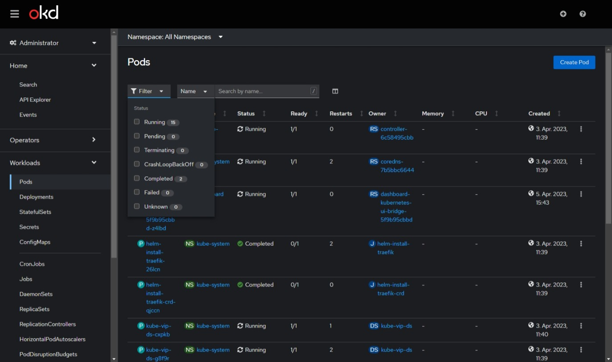
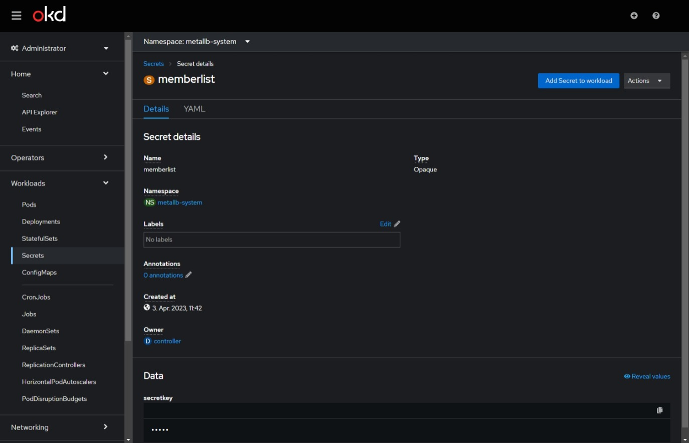
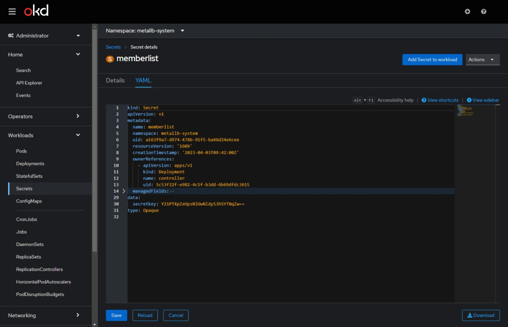

# kubernetes-ui-bridge
Kubernetes UI based on Redhat's openshift console packaged as a Helm chart.

If you have question feel free to open an issue.

For possible configuration check out the [values.yaml](./kubernetes-ui-bridge/values.yaml) and [helmet-paramters](https://github.com/companyinfo/helm-charts/tree/main/charts/helmet).

The chart uses [helmet](https://github.com/companyinfo/helm-charts/tree/main/charts/helmet) for general configuration. Helmet is a [Helm Library Chart](https://helm.sh/docs/topics/library_charts/) that defines many chart templates like Deployment, Service, Ingress, etc which can used in other application charts. Please check it out.

## User Interface

## todo
* implement helm docs generator
* Example install commands
* auth soulotion
